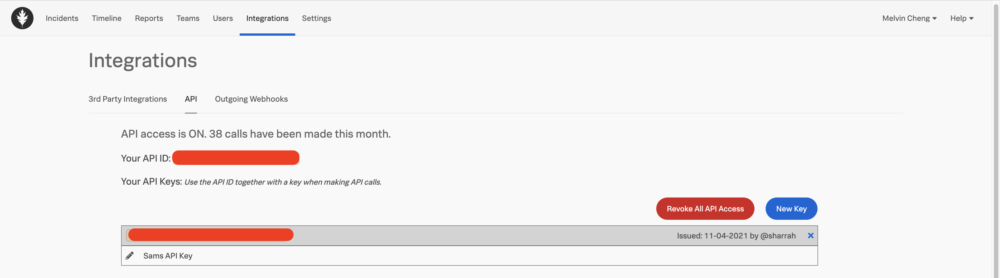
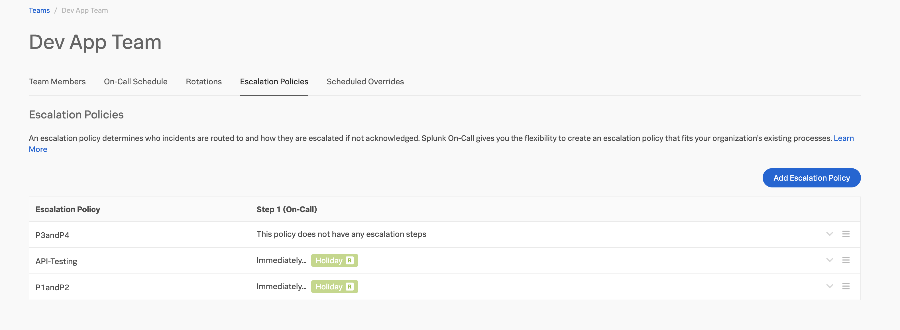
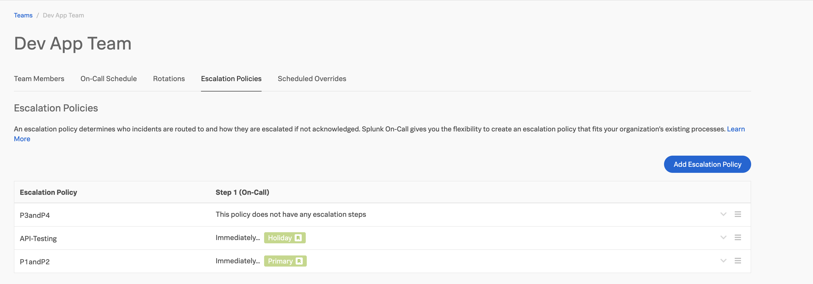

# VictorOps-API

# To automate the Rotation option within Escalation Policy

The document highlights the steps required to update the **Rotation** option in the **Escalation Policy**.


## Step 1 - Retrieve VictorOps Api-id and Api-Key

Retrieve the `api-id` and `api-key` value.

.

## Step 2 - Retrieve Team Details
We will retrieve the name and slug value of all the **Teams** in VictorOps environment.   
Update the <<`api-id`>> and <<`api-key`>> accordingly.
```
curl --location --request GET \
'https://api.victorops.com/api-public/v1/team' \
--header 'X-VO-Api-Id: <<api-id>>' \
--header 'X-VO-Api-Key: <<api-key>>' \
| jq '.[] | .name, .slug'
```
### Sample Output
```
"Waiting Room"
"team-p9MXeGB2iGGfVZcL"
"Dev App Team"
"team-0OboBrIJmmWyJJSn"
```
##  <a id="Step3"></a>Step 3 - Retrieve Rotation Details

We will retrieve the label and slug value for the **Rotation** using the **Team slug** that we have retrieved in the previous step.
```
curl --location --request GET 
'https://api.victorops.com/api-public/v1/teams/team-0OboBrIJmmWyJJSn/rotations' \
--header 'X-VO-Api-Id: <<api-id>>' \
--header 'X-VO-Api-Key: <<api-key>>' 
| jq '.rotationGroups[] | .label, .slug'
```

### Sample Output
```
"Holiday"
"rtg-xHrKsuODZfpfuker"
"Primary"
"rtg-b4hy6TVv8PCWCPRq"
```
 
## <a id="Step4"></a>Step 4 - Retrieve Escalation Policies Details

We will retrieve the policy name and slug value for all the **Escalation Policies** details in VictorOps environment.
```
curl --location --request \
GET 'https://api.victorops.com/api-public/v1/policies' \
--header 'X-VO-Api-Id: <<api-id>>' \
--header 'X-VO-Api-Key: <<api-key>>' \
| jq '.policies[] | .policy.name , .policy.slug, .team.slug '
```
### Sample Output
```
"P3andP4"
"pol-f2iO1cVz2TH57IFy"
"team-0OboBrIJmmWyJJSn"
"API-Testing"
"pol-stiyQadb5Sj3ro1K"
"team-0OboBrIJmmWyJJSn"
"P1andP2"
"pol-bEaTn9Y3zQ3vPf3U"
"team-0OboBrIJmmWyJJSn"
```

> We recommend backing up all the full Escalation Policies output (JSON)
> before proceeding the next step.


## Step 5 - Retrieve Specific Escalation Policies Details

We will retrieve the specific *Policy details* that is attached to the specified **Escalation Policy**

In this example we are modifying the *P1andP2* Escalation Policy.
```
curl --location --request 
GET 'https://api.victorops.com/api-public/v1/policies/pol-bEaTn9Y3zQ3vPf3U' \
--header 'X-VO-Api-Id: <<api-id>>' \
--header 'X-VO-Api-Key: <<api-key>>' 
```

### Sample Output
```
{
    "name": "P1andP2",
    "slug": "pol-bEaTn9Y3zQ3vPf3U",
    "steps": [
        {
            "timeout": 0,
            "entries": [
                {
                    "executionType": "rotation_group",
                    "rotationGroup": {
                        "slug": "rtg-xHrKsuODZfpfuker",
                        "label": "Holiday"
                    }
                }
            ]
        }
    ],
    "ignoreCustomPagingPolicies": false
}
```

## Step 6 - Delete Escalation Policies 

We need to identify and remove the existing **Escalation Policy**. The identification of the escalation policy is based on **Policy slug** value that we have retrieved in the previous step.
```
curl --location --request 
DELETE 'https://api.victorops.com/api-public/v1/policies/pol-bEaTn9Y3zQ3vPf3U' \
--header 'X-VO-Api-Id: <<api-id>>' \
--header 'X-VO-Api-Key: <<api-key>>'
```

### Sample Output
```
{
"result": "success"
}
```

## Step 7 - Create New Escalation Policies

We will create the new **Escalation Policy** . Few values we need to populate for the JSON input data


 - teamSlug  [Step4](#step-4---retrieve-escalation-policies-details)
 - rotationGroup.slug [Step3](#step-3---retrieve-rotation-details)
 - rotationGroup.label  [Step3](#step-3---retrieve-rotation-details)

```
curl --location --request 
POST 'https://api.victorops.com/api-public/v1/policies' \
--header 'X-VO-Api-Id: <<api-id>>' \
--header 'X-VO-Api-Key: <<api-key>>' \
--header 'Content-Type: application/json' \
--data-raw '{
"name": "P1andP2",
"teamSlug": "team-0OboBrIJmmWyJJSn",
"ignoreCustomPagingPolicies": false,
"steps": [
	{
		"timeout": 0,
		"entries": [
		{
		       "executionType": "rotation_group",
		        "rotationGroup": 
		        {
			        "slug": "rtg-b4hy6TVv8PCWCPRq",
			        "label": "Primary"
		        }
		}]
	}]
}'
```

### Sample Output

Before deleting Escalation Policy



After Creating new Escalation Policy and Removal of the previous Esclation Policy


